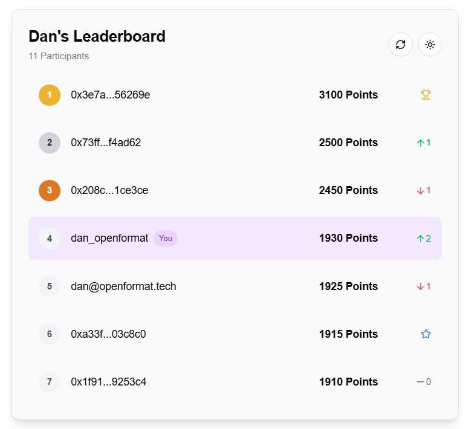
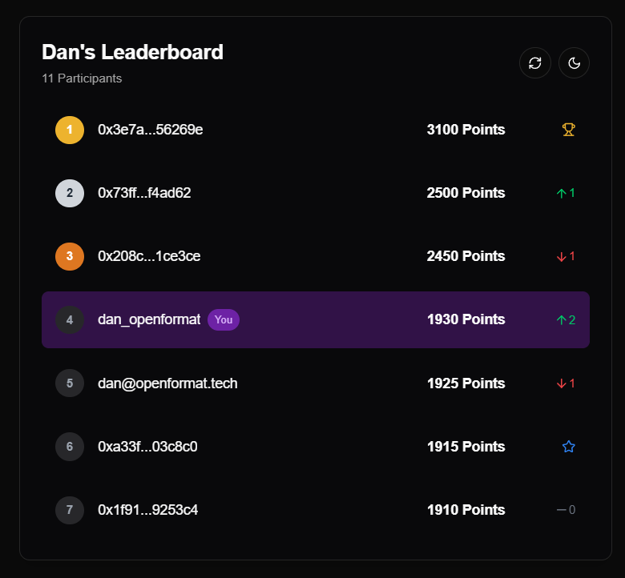

# On-Chain Leaderboard

A simple leaderboard that shows the users based on the amount of on-chain points they have. The user logs in using Privy and the leaderboard will show their position.



## Features

- 🔗 On-chain points leaderboard using [OpenFormat's](https://app.openformat.tech/) leaderboard API
- 🔐 Authentication with Privy (Email, Wallet, Discord, Google)
- 📊 Indication of the change in position over the past week
- 👤 Smart user handle display based on connected social accounts (Email, Discord, or truncated wallet address)
- 🌓 Dark/Light mode support

## Getting Started

### Prerequisites
Before you begin, you'll need to set up accounts and configure the following:
1. **[Open Format Dashboard](https://app.openformat.tech/)**
- Create an account at [Open Format Dashboard](https://app.openformat.tech/)
- Create a new dApp to get your `OPENFORMAT_DAPP_ID`
- Generate an API key to get your `OPENFORMAT_API_KEY`
2. **[Privy Dashboard](https://dashboard.privy.io/)**
- Create an account at [Privy Dashboard](https://dashboard.privy.io/)
- Create a new app to get your `NEXT_PUBLIC_PRIVY_APP_ID` from the Settings section of your Privy app
- If you want to show the other user's social handles in the leaderboard then get your `PRIVY_APP_SECRET` from the Settings section of your Privy app and add it to the `.env.local` file
- In the Login Methods section of your Privy app, enable:
    - Discord
    - Google
    - Email

### Deploy
Instantly deploy your own copy of the template using Vercel or Netlify:

[](https://vercel.com/new/clone?repository-url=https%3A%2F%2Fgithub.com%2Fopen-format%2Fon-chain-leaderboard&env=NEXT_PUBLIC_OPENFORMAT_API_KEY,NEXT_PUBLIC_OPENFORMAT_DAPP_ID,NEXT_PUBLIC_PRIVY_APP_ID,PRIVY_APP_SECRET) [](https://app.netlify.com/start/deploy?repository=https://github.com/open-format/on-chain-leaderboard)


### Local Development

1. Clone the repository
```
git clone https://github.com/open-format/on-chain-leaderboard.git
cd on-chain-leaderboard
```

2. Install dependencies:
```
npm install
# or
yarn install
# or
pnpm install
```

3. Create a .env.local file in the root directory and add the following:
```
NEXT_PUBLIC_PRIVY_APP_ID=your_privy_app_id
PRIVY_APP_SECRET=your_privy_secret
NEXT_PUBLIC_OPENFORMAT_API_KEY=your_openformat_api_key
NEXT_PUBLIC_OPENFORMAT_DAPP_ID=your_openformat_app_id
```

5. Start the development server:
```
npm run dev
# or
yarn dev
# or
pnpm dev
```
6. Open http://localhost:3000 in your browser.

## Environment Variables

| Variable | Required | Example | Description |
|----------|----------|----------|-------------|
| NEXT_PUBLIC_PRIVY_APP_ID | Yes | cgg24234jq2373ryeh719gutpc | Your [Privy](https://www.privy.io/) application ID |
| PRIVY_APP_SECRET | No | 3NRygyUVJcH2qcCeS8F25ymbis7FZEBPUW4kP52oWjqNUGVrdQcot5JL6 | Your [Privy](https://www.privy.io/) app secret |
| NEXT_PUBLIC_OPENFORMAT_API_KEY | Yes | b315346c-d43b-4b37-aee9-621fgdg415b8e | Your [Open Format](https://app.openformat.tech/) API Key |
| NEXT_PUBLIC_OPENFORMAT_DAPP_ID | Yes | 0x0747d8a6e968422a4e506e820f51efaef757956c | Your [Open Format](https://app.openformat.tech/) dApp ID |


## Contributing 
Contributions are welcome! Please open an issue or submit a pull request. If you have any questions, feel free to reach out at [dan@openformat.tech](mailto:dan@openformat.tech)


